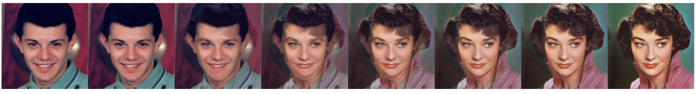

## Refusion-HDR (ICCV AIM2025 Inverse Tone Mapping Challenge) 

Our solution simply use [[Refusion]](https://arxiv.org/abs/2304.08291)(CVPRW 2023), more details please check [[official implementation]](https://github.com/Algolzw/image-restoration-sde). </sub>

## Dependenices

* OS: Ubuntu 20.04
* nvidia :
	- cuda: 11.7
	- cudnn: 8.5.0
* python3
* pytorch >= 1.13.0
* Python packages: `pip install -r requirements.txt`

## How to use our Code?

### Train
The main code for training is in `codes/config/deraining` and the core algorithms for IR-SDE is in `codes/utils/sde_utils.py`.

You can train the model following below bash scripts:

```bash
cd codes/config/HDR

# For single GPU:
python train.py -opt=options/train/refusion.yml

# For distributed training, need to change the gpu_ids in option file
python run_itm.py -opt_path options/test/refusion.yml -input_dir AIM_TEST -output_dir output -pretrained_path lastest_EMA.pth
```

Then the models and training logs will save in `log/HDR_sde/`. 
You can print your log at time by running `tail -f log/HDR_sde/train_derain_sde_***.log -n 100`.

### Evaluation
To evaluate our method, please modify the benchmark path and model path and run

```bash
cd codes/config/HDR
python run_itm.py -opt_path options/test/refusion.yml -input_dir AIM_TEST -output_dir output -pretrained_path lastest_EMA.pth
```

Pretrained model [here](https://www.dropbox.com/scl/fi/yg44t2i9tgrlsn3c1punc/lastest_EMA.pth?rlkey=fhjb37o34i9yt12337pyed5gi&st=43psqej3&dl=0) on ICCV AIM2025 Inverse Tone Mapping Challenge datasets.

### Gradio
Here we provide an [app.py](https://github.com/Algolzw/image-restoration-sde/blob/main/codes/config/deraining/app.py) file for testing your own images. Before that, you need to download the pretrained weights and modify the model path in `test_sde_derain.yml`. Then by simply running `python app.py`, you can open `http://localhost:7860` to test the model. (We also provide 3 raining images from Rain100H in `images` dir).

### Some Results

<div align='center'>HR Non-Homogeneous Dehazing</div>


<div align='center'>Image Shadow Removal</div>


### Interpolation
We also provide a interpolation demo to perform interpolation between two images in `codes/demos/interpolation.py`, the usage is:

```bash
cd codes/demos
python interpolation.py -s source_image_path -t target_image_path --save save_dir
```

#### Example of interpolation:



## Citations
If our code helps your research or work, please consider citing our paper.
The following are BibTeX references:

```
@article{luo2023image,
  title={Image Restoration with Mean-Reverting Stochastic Differential Equations},
  author={Luo, Ziwei and Gustafsson, Fredrik K and Zhao, Zheng and Sj{\"o}lund, Jens and Sch{\"o}n, Thomas B},
  journal={International Conference on Machine Learning},
  year={2023},
  organization={PMLR}
}

@inproceedings{luo2023refusion,
  title={Refusion: Enabling Large-Size Realistic Image Restoration with Latent-Space Diffusion Models},
  author={Luo, Ziwei and Gustafsson, Fredrik K and Zhao, Zheng and Sj{\"o}lund, Jens and Sch{\"o}n, Thomas B},
  booktitle={Proceedings of the IEEE/CVF Conference on Computer Vision and Pattern Recognition Workshops},
  pages={1680--1691},
  year={2023}
}
```

---

#### Contact
E-mail: ziwei.luo@it.uu.se

#### --- Thanks for your interest! --- ####

